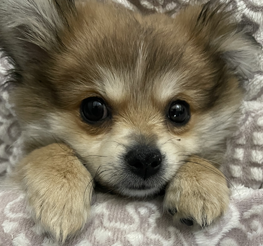
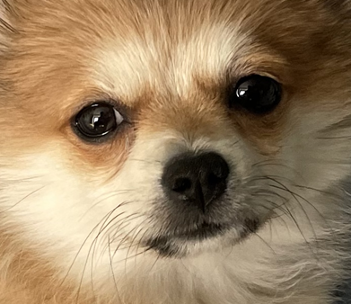
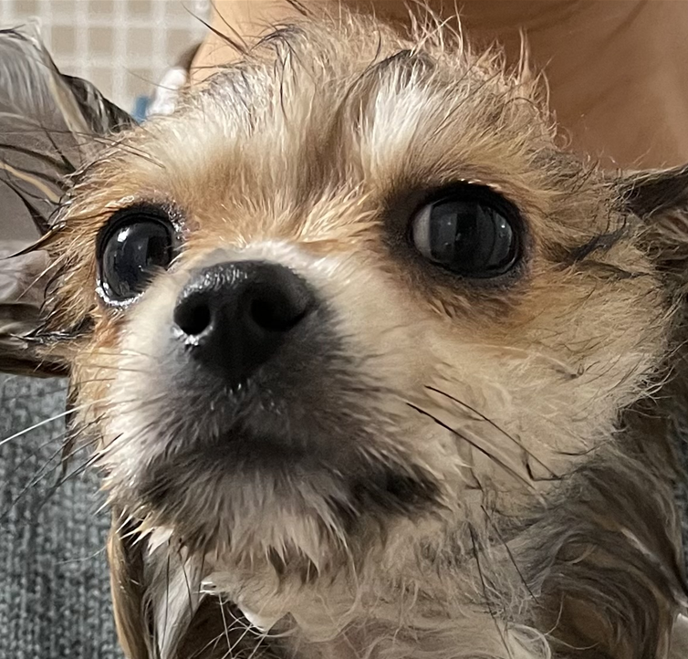
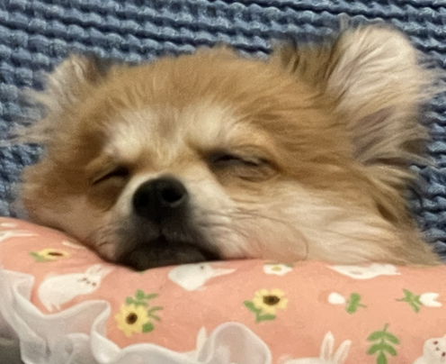
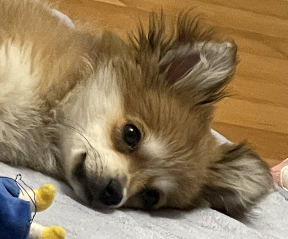

# Boostcamp AI Level.1 P-stage : Mask Image Classfication
> **Task** : Classify the person in the picture among 18 cateogires, which describe 'gender','age', 'well-mask-fit'

## Overview of the Project
### Goal
* Classify the correct class for the given person in the image
### Properties of Dataset
* Dataset folder as follows : Each folder has **7 images with a single person** but has different condition- 5 images w/ mask, a single image w/o mask, a single image w/ incorrect mask worn.
* Total # of image samples: 2700 folders * 7 images = **18,900 images**
* Label information : 18 classes

| class | Mask      | Gender | Age         |
|-------|-----------|--------|-------------|
| 0     | wear      | Male   | <30         |
| 1     | wear      | Male   | >=30 & < 60 |
| 2     | wear      | Male   | >=60        |
| 3     | wear      | Female | <30         |
| 4     | wear      | Female | >=30 & < 60 |
| 5     | wear      | Female | >=60        |
| 6     | incorrect | Male   | <30         |
| 7     | incorrect | Male   | >=30 & < 60 |
| 8     | incorrect | Male   | >=60        |
| 9     | incorrect | Female | <30         |
| 10    | incorrect | Female | >=30 & < 60 |
| 11    | incorrect | Female | >=60        |
| 12    | Not wear  | Male   | <30         |
| 13    | Not wear  | Male   | >=30 & < 60 |
| 14    | Not wear  | Male   | >=60        |
| 15    | Not wear  | Female | <30         |
| 16    | Not wear  | Female | >=30 & < 60 |
| 17    | Not wear  | Female | >=60        |

* Class distribution : Please refer to EDA jupyter notebook.
* Several noisy labels.
  
* **Main challenges** : Comparably small dataset and the imbalanced properties' distributions, specially in the case of ages, lead to overall imbalance across final classes.
### Metric
* F1 score

## Our Approaches

### (IDEATION) How to handle OVERFITTING problems?
* Handle class imbalance problems, specifically, the boundary of age between [30,60) and [60,) are AMBIGUOUS.
    * (Data sampling approach) Oversampling & Undersampling: using opensource ImbalancedSampler and WeightedRandomSampler provided in pytorch.
    * (Loss) Different weight based on the classses' distribution : WeightedCrossentropy, Focal Loss, LDAM Loss
    * (Loss) Calculating loss considering F1 score metric : F1 Loss
    * (Augmentation) Choose empirically helpful transformation(e.g, ColorJitter, HorizontalFlip,CenterCrop) and avoid harful transformation(e.g, VerticalFlip)
    * (Augmentation) Removing backgrounds and crop so that our model can focus more on the face.
* Small dataset? Easy to be overfitted.
    * (Model) The family of EfficientNet: Consider the variants of light model.
    * (Tunning policy) Full fine-tuning:  empirically working better than freezing feature extractor layers.
    * (Modifed version) Stacking additional FC layer : Relying solely on the pretrained feature extractor and single final classifier could not fit into our downstream task. Since all the pre-trained models are from nature image, ImageNet.
    
### Main Remedies 
> F1 score: 0.7432 , Accuracy: 79.1905
* Model : Efficientnet-b3 adding additional FC layer followed by dropout(0.7)
* Augmentation : torchvision
    * Train:
      ```python
        train_transform = transforms.Compose([transforms.Resize(args.img_resize),
                                          transforms.CenterCrop(args.img_crop),
                                          transforms.ColorJitter(brightness=0.5, contrast=0.5, saturation=0.5, hue=0.5),
                                          transforms.RandomHorizontalFlip(),
                                          transforms.ToTensor()])
        ```

    * Val :
        ```python
        val_transform = transforms.Compose([transforms.Resize(args.img_resize),
                                        transforms.CenterCrop(args.img_crop),
                                        transforms.ToTensor()])
        ```
* Loss: Crossentropy
* Optimizer: Adam
    * Learning rate: 1e-4
    * Scheduler : 0.995 @ every epoch
    
### Additional Trials 
- [x] **WeightedRandomSampler, ImbalancedDatasetSampler** : No improvements. Sometime similar to focal loss. More predictions on minor classes but F1 scores wasn't improved
- [x] **Loss(Focal loss, LDAM loss, F1 loss, weightedCrossEntropy, Labelsmoothing loss)** : No improvements. (But.. with smaller lr, maybe it would have worked. Couldn't try)
- [x] **Training as multi-task regime with classification estimating class and regression model to estimate age** : Oops. w/o weight on regression loss, terrible scores. Multiplying **0.001** worked better than not doing it. But the model missed out the elder classes even more.
- [x] **Various previous model** : Resnet18,resnet50,densenet has poorer performance. They have more number of parameters than the (small-medium size) efficient net.
- [x] **Multi dropout** : No improvements..T_T
- [x] **Out of fold & TTA(original+flip) & Ensemble** : about to have results! (Lowering learning rate works better)
- [x] **Different initialization(e.g, xavier) at the final layer** : ?!?!? worse..(need to check which initialization method is applied in pytorch)
- [x] **Differing batch size, lr, optimizer(e.g, AdamW, momentumSGD with nesterov)** : It seems to have minor improvements. Therefore we didn't do extensive hyperparameter sweeping.
- [x] **Training GAN to make synthetic data!!** : kind of.. ended up with ghost-like images. Keep going JS!
- [x] **Erasing backgrounds and sharpening edges** : Taking too much time.

### Validation
* Stratified 5-Fold
    * By modifying the baseline code, we split folder **k** fold and validated them instead of using sklearn packages.

# Usage
### Installation
```python
pip install -r requirements.txt
```
### Scripts Example
* For a single model :  `sh ./scripts/run_exp.sh`
* For K-fold with TTA, ensemble : `sh ./scripts/run_kfold.sh`

### Hyperparameters (Arguments)
* Please see **argparse description** in `train.py`, `k_fold.py` 

# Takeaway

### Need to Fix!
* Avoiding hard-coding when sharing codes. ESPECIALLY directory or path.
* Should have merged the baseline codes earlier?

# About us

김소연|김준석|임동진|하성진|최성원|
:-:|:-:|:-:|:-:|:-:
[kimcando](https://github.com/kimcando)|[junseok0408](https://github.com/junseok0408)|[ldj7183](https://github.com/idj7183)|[maxha97](https://github.com/maxha97)|최성원|
</img>|</img>|</img>|</img>|</img>


# Acknowledgements & References
* ImbalancedDatasetSampler
